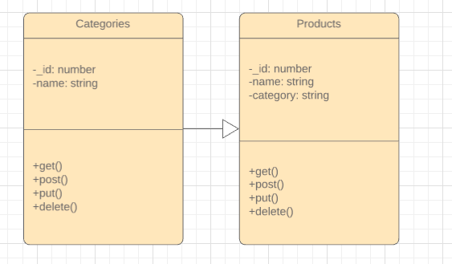

# LAB - 08

## Project Name
Data Modeling

### Author: Student/Group Name
Tia Rose

### Links and Resources
* [submission PR](https://github.com/tia-rose-401-advanced-javascript/modeling/pull/1)
* [travis](http://xyz.com)
* [back-end](https://dry-anchorage-50002.herokuapp.com)

#### Documentation
* [api docs](http://xyz.com) (API servers)
* [jsdoc](http://xyz.com) (Server assignments)
* [styleguide](http://xyz.com) (React assignments)

### Modules
#### `modulename.js`
##### Exported Values and Methods

###### `foo(thing) -> string`
Usage Notes or examples

###### `bar(array) -> array`
Usage Notes or examples

### Setup
#### `.env` requirements
* `PORT` - 3000
* `MONGODB_URI` - 'mongodb://localhost:27017/class-08'

#### Running the app
* `npm start`
* Endpoint: `/foo/bar/`
  * Returns a JSON object with abc in it.
* Endpoint: `/bing/zing/`
  * Returns a JSON object with xyz in it.
  
#### Tests
* How do you run tests?
npm test
* What assertions were made?
* What assertions need to be / should be made?

#### UML
